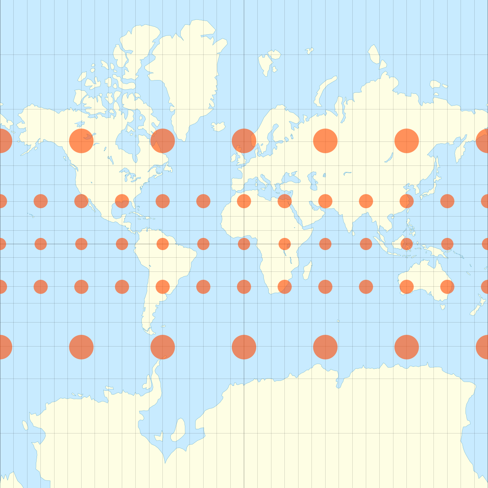

# Converting Mercator projection to equirectangular

This is not a scientific tool.

It is a simplified version of the tool described by: http://paulbourke.net/panorama/webmerc2sphere/index.html

```
usage: mercator_to_equirectangular.py input_image output_image
```

Source for input.png is [Wikipedia](https://en.wikipedia.org/wiki/Mercator_projection#/media/File:Mercator_with_Tissot's_Indicatrices_of_Distortion.svg) (unmodified, Author: Justin Kunimune, License: [CC BY-SA 4.0](https://creativecommons.org/licenses/by-sa/4.0/)).

Comparing the output of this script with the [image of a equirectangular projection on Wikipedia](https://en.wikipedia.org/wiki/Equirectangular_projection#/media/File:Plate_Carr%C3%A9e_with_Tissot's_Indicatrices_of_Distortion.svg), the output looks good enough for my use case.

Input             |  Output
:-------------------------:|:-------------------------:
  |  